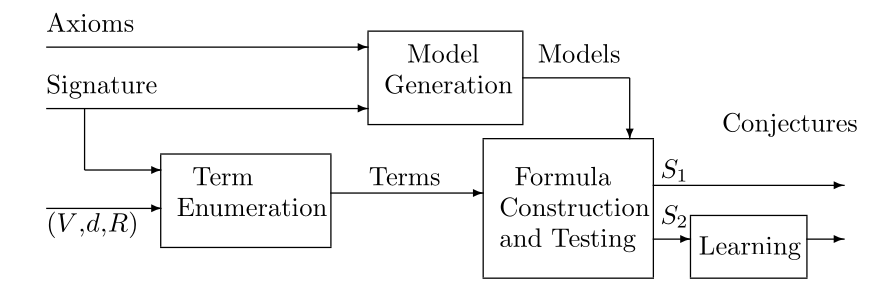

## Readme

### MCS工具说明

MCS: Model-Based Conjecture Searching

​	自动定理证明器用于证明定理猜想，但那些猜想定理从何而来？大多由用户提供，但用户可能会错过一些有趣的猜测，添加几个关键引理可以使自动定理证明更容易。因此，系统地生成一些简单的公式，并进行理论验证是有益的。

​	MCS工具方法本质上是**生成和测试**。对于由特征和一组公理组成的理论，执行以下操作：

1. 生成有限模型的集合
2. 生成一组封闭的格式良好的公式集
3. 以模型测试公式的正确性。



​	对于非简单理论，有过多的公式。选择先生成一些简单的项，然后构造特定形式的公式。MCS为了生成项，有3个主要参数：

- $V$：变量集
- $d$：一个正整数
- $R$：重写规则的集合

生成的项不会包含$V$之外的变量，而且在变量重命名后各不相同。每项中函数符号出现的次数不得超过$d$。如果$R$非空，这些项对于规则$R$不可约。

### 编译运行说明

首先进入项目目录，`make`即可完成编译，编译后生成可执行文件mcs，通过`./mcs`+运行参数

mcs程序需要理论(theory)的模型作为输入，模型生成器mace4的可执行文件位于bin目录下

输入格式为mace4的结果通过bin/interpformat处理后得到的cooked格式

以以下指令为例，可以得到mcs的模型输入文件

```
bin/mace4 -f test/Group_theory.in | bin/interpformat cooked > Group_theory.m
```

mcs运行参数解释：

- -input xxx.m：输入文件为xxx.m，输入为理论的模型
- --output result ：指定输出文件为result
- --maxdepth 3：指定生成项深度不超过3
- --value '["x","y"]' ： 指定变量集合V
- --rewrite 'f(x,x)=x.'：指定等式形式的重写规则，注意输入要符合Prover9定理证明器的格式(每个规则要接一个`.`)，由Prover9处理重写规则，目前只支持KB完备的重写规则。

#### 运行实例

(1).群理论：

test/Group_theory.in：

```mace4
assign(start_size, 8).
assign(end_size, 8).
assign(increment, 1).
assign(max_seconds_per, 10).
assign(max_models, 12).

formulas(assumptions).
x * y = y * x .
x * e = x .
x*(y*z) = (x*y)*z.
e * x = x.
x' * x = e .
x * x' = e.

end_of_list.
```

运行指令

```
bin/mace4 -f test/Group_theory.in | bin/interpformat cooked > Group_theory.m
./mcs --input Group_theory.m --output result --maxdepth 2 --value '["x","y"]' --rewrite ''
```

生成项数量为24，生成猜想公式数量为21

(2).QG5理论

这里提供了手动生成的QG5模型：QG5.out

```
./mcs --input qg5.out --output result --maxdepth 3 --value '["x","y"]' --rewrite 'f(x,x)=x.'
```

生成项数量为23，生成猜想数量为6

(3).环理论

test/ring_theory.in

```
assign(start_size, 6).
set(integer_ring).
assign(max_models, 8).


formulas(assumptions).
  x + y = y + x.
  (x * y) * z = x * (y * z).
  x * (y + z) = (x * y) + (x * z).
  (x + y) * z = (x * z) + (y * z).
  x + e = x.
  e + x = x.
  e * x = e.
  x * e = e.
end_of_list.
```

运行指令：

```
bin/mace4 -f test/ring_theory.in | bin/interpformat cooked > ring_theory.m 
./mcs -i ring_theory.m -o result_ring -d 2 -v '["x","y"]' --rewrite 'x+e=x.e+x=x.x*e=e.e*x=e.'
```

生成项数量为39，猜想数量为24

(4)布尔理论

test/bool_theory.in

```
assign(start_size, 8).
assign(max_models, 3).

formulas(assumptions).

  x * y = y * x.
  x + y = y + x.

  (x * y) * z = x * (y * z).
  (x + y) + z = x + (y + z).

  x * (y + z) = (x * y) + (x * z).
  x + (y * z) = (x + y) * (x + z).

  x * x = x.
  x + x = x.

  x * I = x.
  x + O = x.

  x * O = O.
  x + I = I.

  x * x' = O.
  x + x' = I.
end_of_list.

```

运行指令：

```
bin/mace4 -c -f test/bool_theory.in | bin/interpformat cooked > bool_theory.m
./mcs -i bool_theory.m -o result_bool -d 2 -v '["x"]' --rewrite "x*x=x.x+x=x."
```

生产项数量为19，生成猜想数量为45